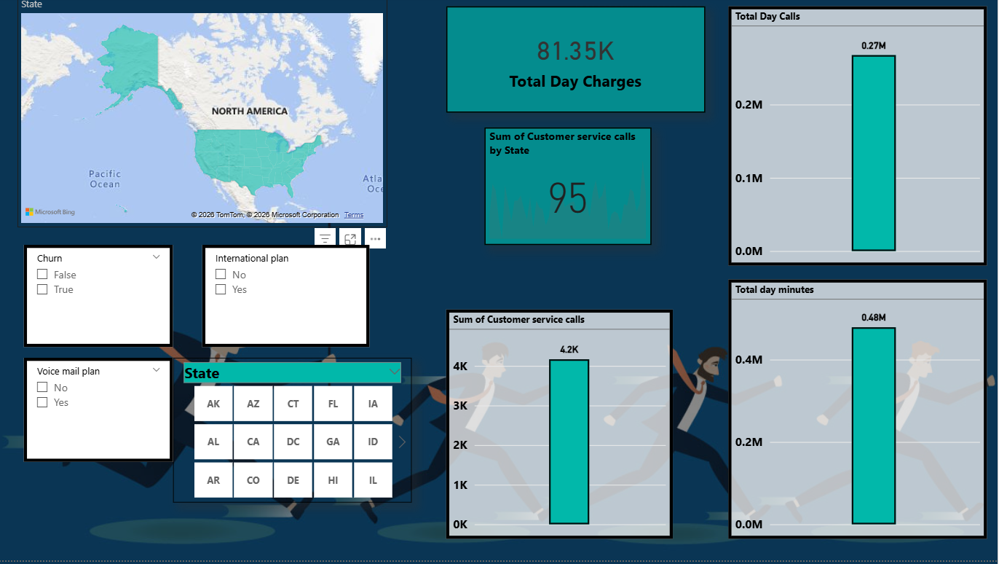
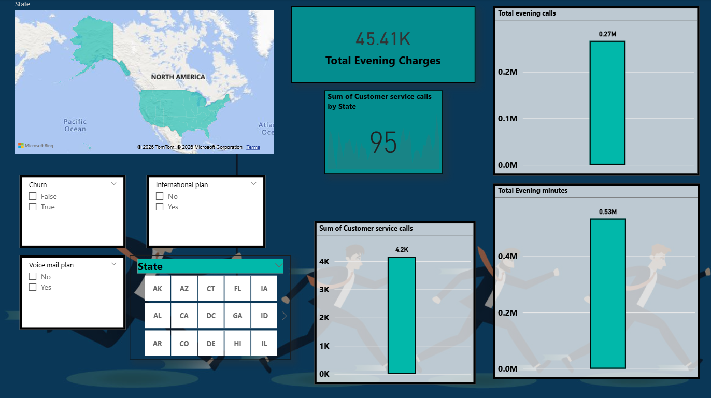
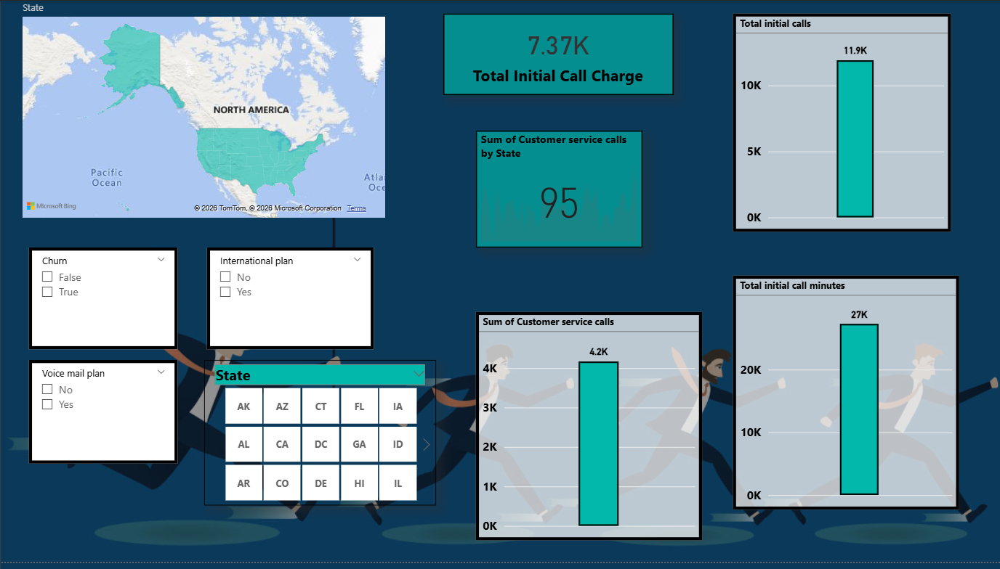
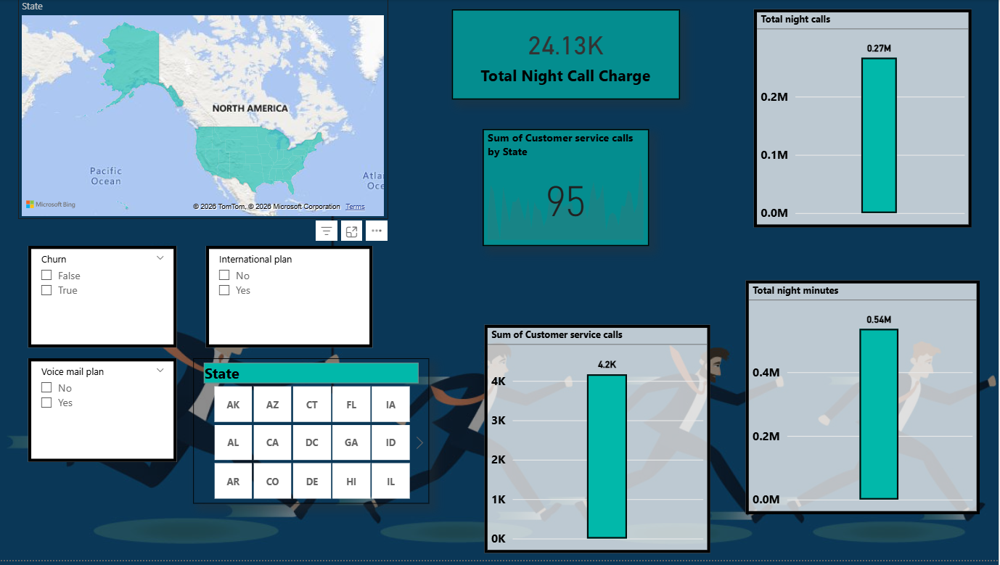
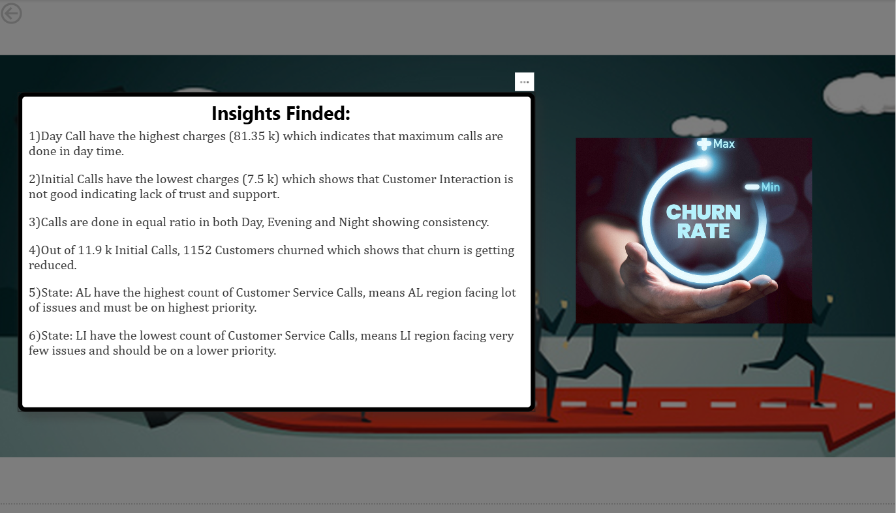

# Telecom Customer Churn Analysis Dashboard

## Overview

This project presents a **Power BI dashboard for analyzing telecom customer churn patterns**.  
The dashboard provides insights into **call behavior, revenue generation, customer support activity, and churn trends** across different time periods and geographic regions.

The objective of this project is to help telecom companies **identify churn indicators, optimize customer service operations, and improve revenue strategies.**

---

# Dashboard Pages

## 1. Day Call Analysis
Key metrics analyzed:

- Total Day Charges
- Total Day Calls
- Total Day Minutes
- Customer Service Calls

Insights:
- Daytime calls generate the highest revenue.
- Majority of customer service interactions occur during daytime.
- Indicates peak operational hours for telecom usage.

---

## 2. Evening Call Analysis

Key metrics analyzed:

- Total Evening Charges
- Total Evening Calls
- Total Evening Minutes
- Customer Service Calls

Insights:
- Evening call volume remains high.
- Charges are lower than daytime despite high usage.
- Suggests discounted evening call pricing.

---

## 3. Initial Call Analysis

Key metrics analyzed:

- Total Initial Call Charges
- Total Initial Calls
- Total Initial Call Minutes
- Customer Service Calls

Insights:
- Initial calls contribute the least revenue.
- Represents onboarding or first interaction calls.
- Useful for analyzing customer acquisition behavior.

---

## 4. Night Call Analysis

Key metrics analyzed:

- Total Night Charges
- Total Night Calls
- Total Night Minutes
- Customer Service Calls

Insights:
- Night call usage is high in terms of minutes.
- Charges remain moderate due to night tariffs.
- Indicates strong customer engagement during late hours.

---

## 5. Churn Insights

Major findings from the dashboard:

- Daytime calls generate the highest revenue.
- Initial calls have the lowest revenue contribution.
- Call activity is relatively balanced across day, evening, and night.
- Certain states show higher customer support demand.
- Customer service interactions may indicate churn risk.

---

# View

---

# Key Features

- Interactive state-level filtering
- Customer churn segmentation
- Telecom usage analysis by time period
- Revenue analysis by call type
- Customer service demand monitoring

---

# Tools Used

- Power BI
- Data Modeling
- Data Visualization
- DAX Measures
- Telecom Customer Dataset

---

# Business Value

This dashboard helps telecom operators:

- Identify high churn risk patterns
- Understand customer call behavior
- Optimize customer support operations
- Improve pricing strategies
- Monitor service issues by region

---

# Future Improvements

- Machine learning churn prediction
- Customer lifetime value analysis
- Advanced segmentation of high-risk customers
- Integration with real-time telecom data

---

# Author

Aditya Srivastav